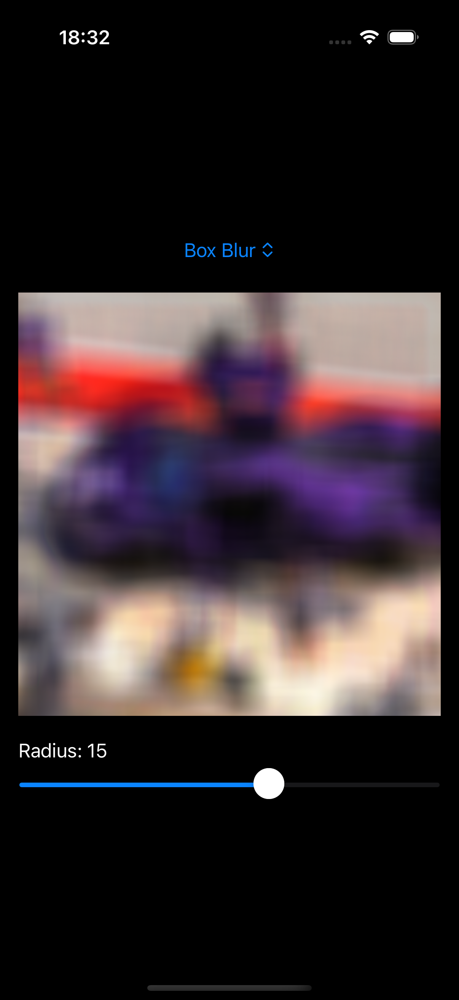

A demo SwiftUI app using Metal shaders to apply a custom blur filters.

**Blur filters:**

- [Gaussian Blur](https://en.wikipedia.org/wiki/Gaussian_blur) – yields a more natural, soft-edged result, but slow.
- [Box Blur](https://en.wikipedia.org/wiki/Box_blur) – damn fast, but can produces a harsher effect for larger radius.

## Preview

## TODO

- [ ] Use different edge sampling for Gaussian blur. Right now, edges are "clamped", which is better than nothing, but they still show some artifacts. I should switch to skipping out-of-bounds values or “bouncing” at the edges for a better looking blur.
- [ ] Improve performance for Gaussian blur. Using a 1D (separable) algorithm instead of a 2D convolution would be the way to go.

## Why?

I just wanted to play around with blur algorithms and see how difficult they are.
